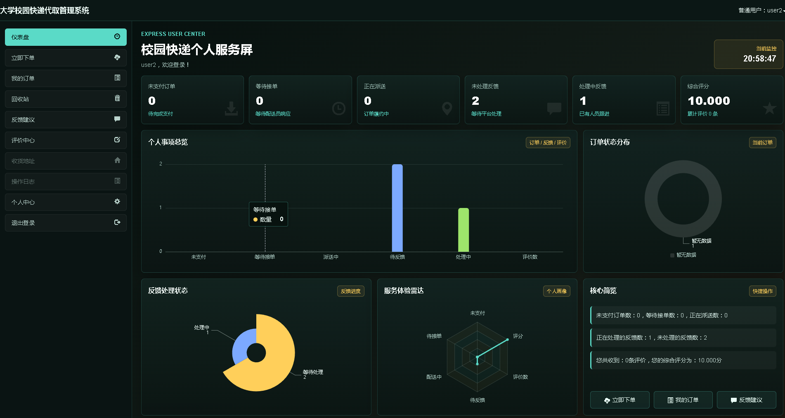
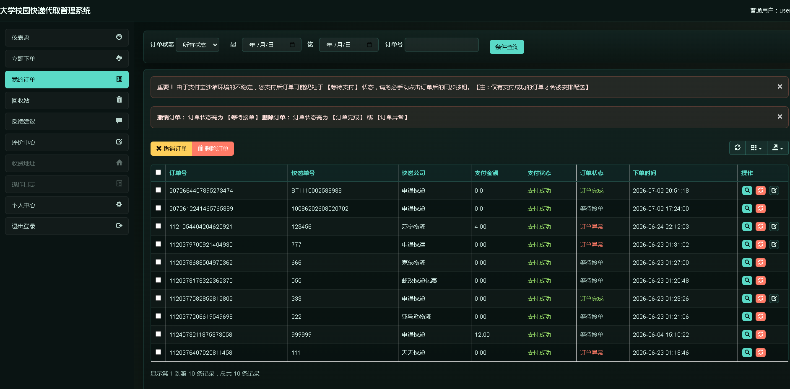
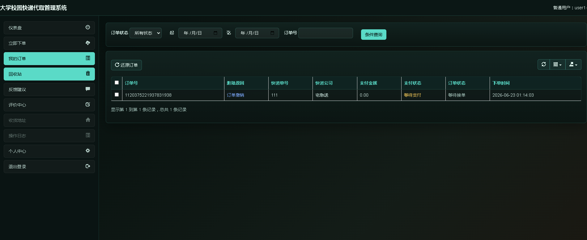
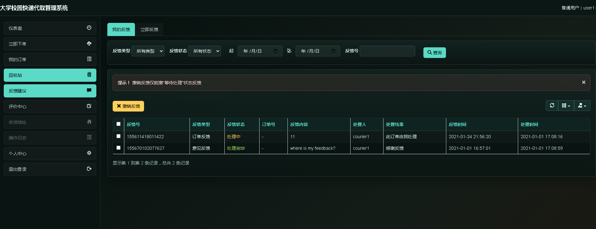
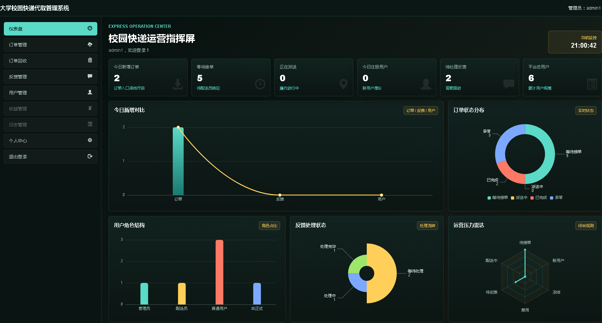
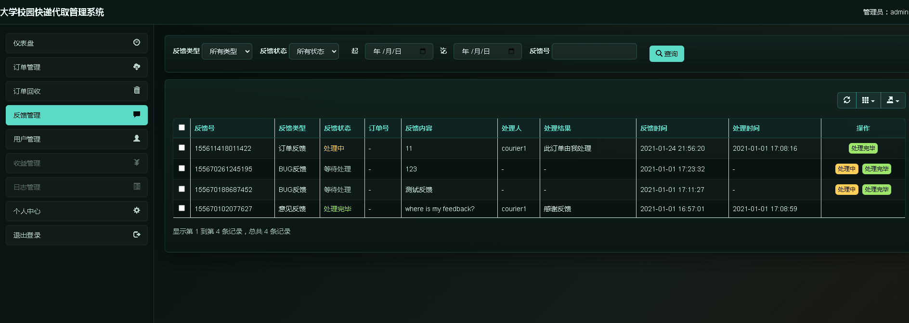

## 计算机毕业设计全新SpringBoot+Vue.js快递代拿系统 快递代取系统(源码+LW+PPT+讲解)

## 要求
### 源码有偿！一套(论文 PPT 源码+sql脚本+教程)

### 
### 加好友前帮忙start一下，并备注github有偿springboot快递代拿
### 我的QQ号是2827724252或者微信:code520888 或者 bysj2023nb

# 

### 加qq好友说明（被部分 网友整得心力交瘁）：
    1.加好友务必按照格式备注
    2.避免浪费各自的时间！
    3.当“客服”不容易，repo 主是体面人，不爆粗，性格好，文明人。

## 开发技术：
springboot mybatis-plus redis缓存 腾讯云短信 支付宝沙盒支付 百度人脸识别
## 主要功能：
1.登陆与注册： 用户名密码、短信验证码、人脸识别登录、QQ登录
2.权限： 普通用户、配送员、后台管理员
3.普通用户：下单支付、订单查询、意见反馈、订单评价
4.配送员：接单、订单管理、意见反馈、订单评价
5.系统管理员：用户管理、订单管理、反馈管理
## 新增创新点
修复人脸识别、短信、支付宝沙箱支付、增加可视化大屏(分用户大屏、管理员大屏)

## 运行视频
https://www.bilibili.com/video/BV1P9T761E2s/

## 运行截图

